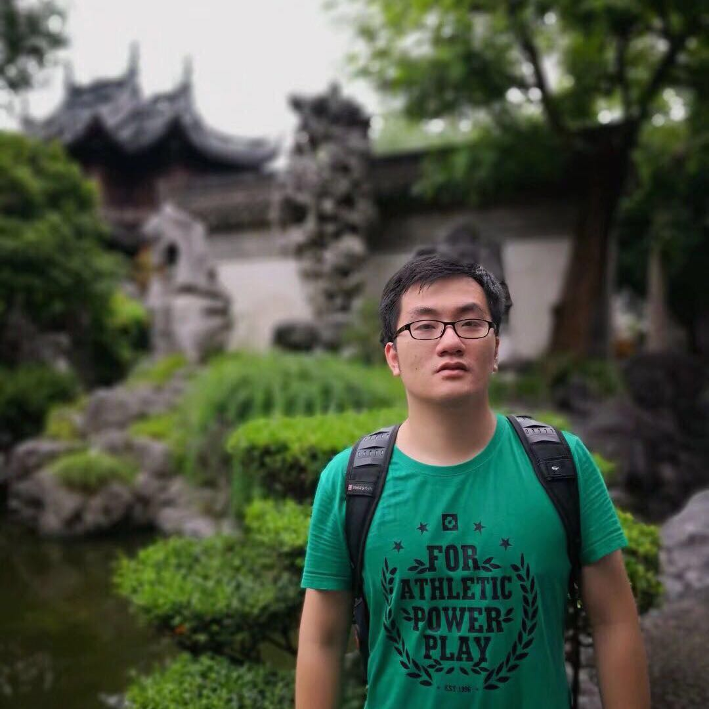

# Welcome to My Website

## Work Experience

- **Apple Inc.**    Beijing City, China  **Data Mining Intern** _Aug 2019_  
Responsibility: Query Understanding for Apple Maps 

## Education

- Indiana University Bloomington    Bloomington, IN, United States  **M.S. in Data Science** _May 2020_  
Courses: Algorithms, Advanced Database Concept, Machine Learning, Deep Learning in NLP 

- Beijing Jiaotong University    Beijing, China  **Ph.D. in Economics** _Jan 2018_ 
Research Interest: Informational Choice, Macro Finance 
Thesis: [Thesis on Effect of Central Bank Communication to Social Welfare](http://cdmd.cnki.com.cn/Article/CDMD-10004-1018082148.htm) 

- Simon Fraser University    Burnaby, BC, Canada   **Visiting Ph.D. in Economics** _Sep 2016_ 
Advisor: [Kenneth Kasa](http://www.sfu.ca/~kkasa/)

- Beijing Jiaotong University    Beijing, China   **B.S. in Science and Technology of Optical Information (Physics)** _Jun 2012_ 
Courses: Quantum Mechanics, Mathematical Methods in the Physical Sciences 

## Skills

- **Programming Languages:**  Python, Java, C, R, Scala

- **Data Analysis & Machine Learning:** NumPy, Pandas, Scipy, Scikit-Learn, Keras, Tensorflow, Pytorch  

- **Natural Language Processing:** NLTK, spaCy, Stanford CoreNLP  

- **Database:** MySQL, PostgreSQL, NoSQL (MongoDB, Neo4j) 

- **Techniques:** Linux, Git, Maven, Docker, Hadoop Ecosystem (Hadoop, HDFS, Apache Spark), A/B testing, D3.js, ggplot2, Tableau  

## Project

- **[Natural Language Processing](https://github.com/jianwenl/NLP)**   

- **[Data Pipeline](https://github.com/jianwenl/Big-Data/blob/master/Report%20for%20ProjectA%EF%BC%9A%20Twitter%20Analysis.pdf)**  

- **[Network Analysis](https://github.com/jianwenl/Big-Data/blob/master/Report%20for%20ProjectB%EF%BC%9A%20Book%20Analysis.pdf)**   

- **[Machine Learning](https://github.com/jianwenl/Machine-Learning)**  

### Contact

[Github](https://github.com/jianwenl/)
[Linkedin](https://www.linkedin.com/in/jianwen-liu-32541266/)
[Email](mailto:jl147@iu.edu)

